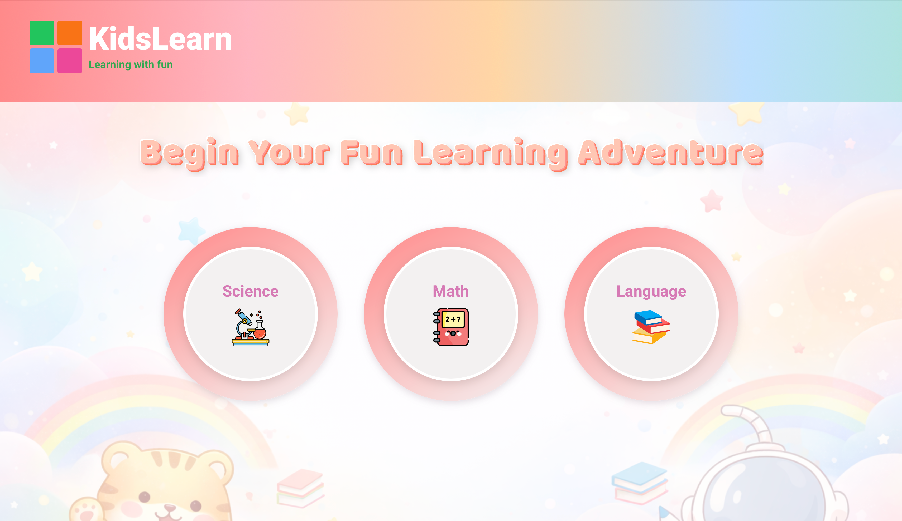
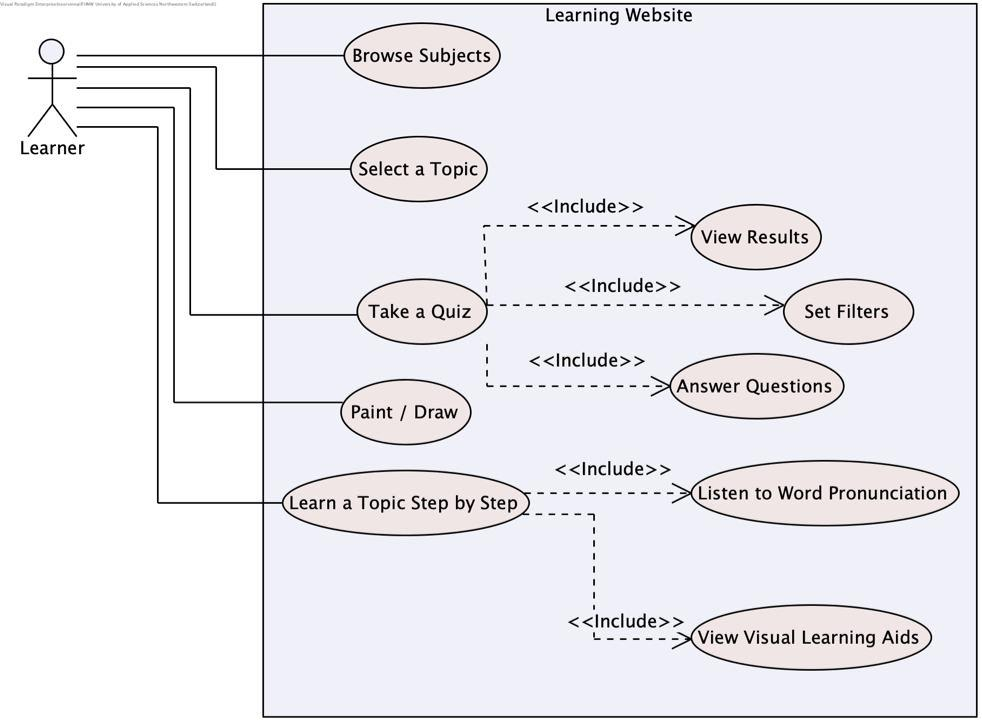
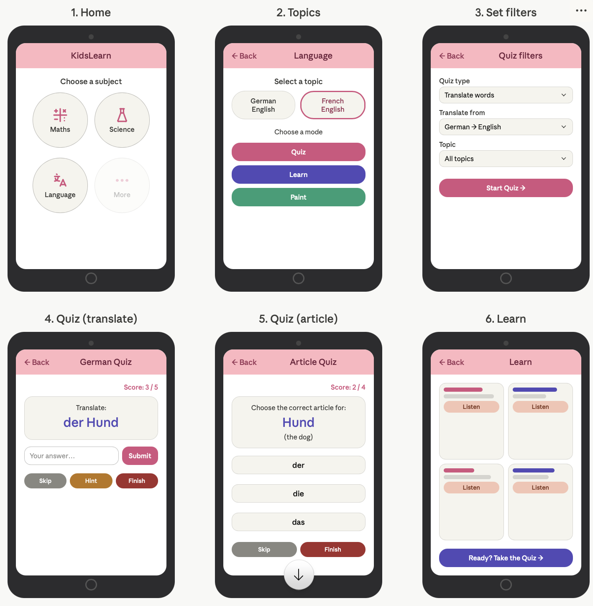
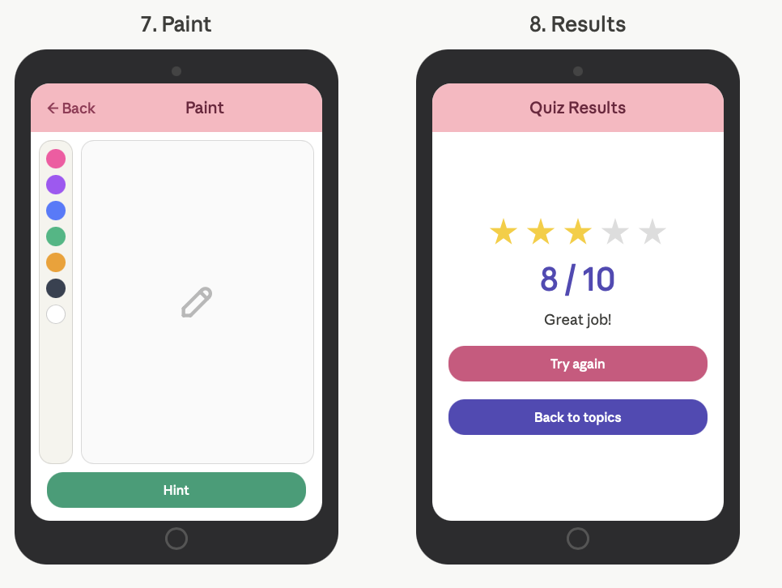
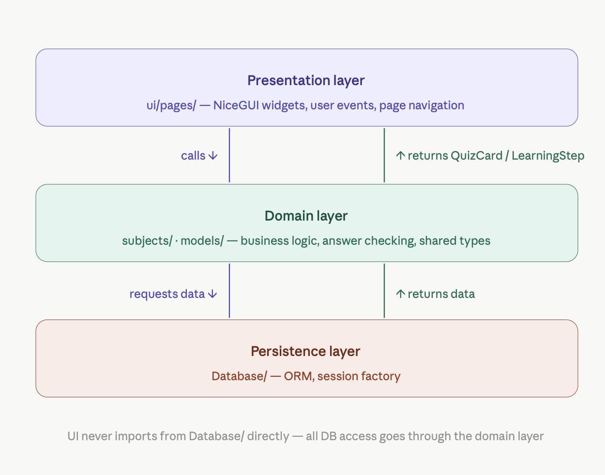
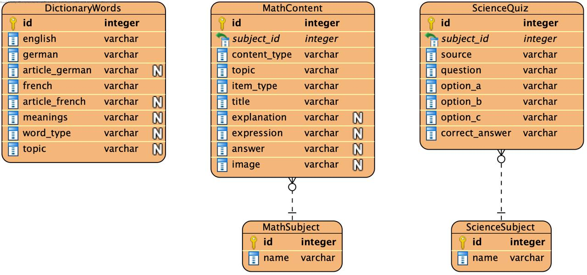

# 🐹 KidsLearn – Interactive Learning Website for Kids



---
## Application Requirements

### Problem

Children often need additional practice outside of school to strengthen their skills in subjects such as vocabulary, mathematics, languages, and science. Traditional worksheets or homework exercises can be repetitive and do not provide immediate feedback.

This project aims to provide a simple interactive learning platform where children can practice educational exercises and receive immediate feedback while parents can observe their learning progress.

---

### Scenario

KidsLearn is a browser-based learning application designed for children practising school subjects at home.

The application allows users to:
- select a subject (Math, Science, or Language) from the home page
- choose a topic within that subject (e.g. Fractions, Biology, German Vocabulary)
- step through learning cards with images and explanations
- take interactive quizzes with real-time feedback and a final score
- listen to word pronunciation during language learning (text-to-speech)
- explore creative painting activities linked to Math and Science topics

---

##  User Stories

### 1. View a List of Subjects
**As a child, I want to see available learning subjects so I can choose one to practise.**

- **Inputs:** none
- **Outputs:** list of available subjects (Math, Science, Language)

---

### 2. Select a Subject
**As a child, I want to select a subject so that I can see its available topics.**

- **Inputs:** selected subject  
- **Outputs:** list of topics for that subject

---

### 3. Select a Topic
**As a child, I want to select a topic within a subject so that I can focus on specific skills.**

- **Inputs:** topic selection
- **Outputs:** mode options for that topic (Quiz, Learn, Paint)

---

### 4. Answer Quiz Questions
**As a child, I want to answer questions in quizzes and receive immediate feedback so that I know if my answer is correct.**

- **Inputs:** quiz answer (text or multiple-choice selection)
- **Outputs:** answer correctness feedback, updated score

---

### 5. View Quiz Results
**As a child, I want to see my results after finishing a quiz so that I 
know how well I did.**

- **Inputs:** completed quiz answers
- **Outputs:** results page with final score

---

### 6. Browse Learning Cards
**As a child, I want to browse learning cards for a topic so that I 
can study before taking a quiz.**

- **Inputs:** topic selection → Learn mode
- **Outputs:** learning cards with text, visuals, and audio

---

### 7. Hear Word Pronunciation
**As a child, I want to hear words pronounced out loud during language learning so that I can learn correct pronunciation.**

- **Inputs:** vocabulary word displayed on a learning card
- **Outputs:** audio playback via text-to-speech (gTTS)

---

### 8. Explore Painting Activities
**As a child, I want to explore painting activities linked to Math and Science topics so that I can be creative while learning.**

- **Inputs:** topic selection → Paint mode
- **Outputs:** interactive drawing canvas with subject-themed pages

---

### 9. Consistent Study Material
**As a parent, I want the vocabulary words and learning steps to remain the same every time my child uses the app, so that I can follow along and support them with what they are studying.**

- **Inputs:** child navigates to a learning or vocabulary topic
- **Outputs:** the same learning cards and vocabulary words are always available across sessions, with no missing or changing study content

---

### 10. Set Quiz Filters
**As a child, I want to set filters before starting a quiz so that I can practise a specific topic and question type.**

- **Inputs:** selected filter options (topic, quiz type, translate direction)
- **Outputs:** filtered quiz session with relevant questions only

---
##  Use Cases



### Main Use Cases
- Browse Subjects (Learner)
- Select a Topic (Learner)
- Take a Quiz (Learner) — includes optional filter selection, answering questions, and viewing results
- Learn a Topic Step by Step (Learner) — available for Math and Language topics
- Listen to Word Pronunciation (Learner) — during Language learning cards
- View Visual Learning Aids (Learner) — illustrations and diagrams shown during Math learning cards
- Paint / Draw (Learner) — available for Math and Science topics

### Actors
- **Learner** – child user who browses subjects, takes quizzes, and steps through learning cards

---
### Wireframes / Mockups




---

##  Architecture

### 3-Tier Layered Architecture



The project is structured as three distinct tiers, each with a single, well-defined responsibility:

| Tier | Location | Responsibility |
|---|---|---|
| **Presentation** | `ui/pages/*.py` | Render NiceGUI widgets and handle user events (button clicks, answer submission, page navigation) |
| **Domain / Business Logic** | `subjects/`, `models/`, `domain/models.py` | Quiz generation, answer checking, filter sanitisation, shared data types (`QuizCard`, `LearningStep`, `Subject`, `Topic`) and SQLModel ORM entities |
| **Persistence** | `Database/db.py`, `Database/seed.py`, `Database/dao.py` | SQLModel engine and `session_scope` facade (`db.py`), CSV seeding (`seed.py`), query classes (`dao.py`) |

Each tier depends only on the tier below it: the presentation tier calls into the domain tier; the domain tier calls into the persistence tier. No layer knows about the layer above it.


### Design Decisions
- **3-Tier Layered Architecture:** Separating `ui/pages/` (presentation), `subjects/` + `models/` (domain logic), and `Database/` (persistence) keeps each tier independently testable and replaceable. Logic-based topic tests (e.g. `Fractions`, `Operation`) require no database; database tests require no UI.
- **Template Method Pattern:** The `Topic` base class defines the algorithm skeleton — `get_question()` is the fixed entry point that dispatches to either `generate_question()` (logic-based) or `_load_question_from_db()` (database-backed) depending on `quiz_source`, and `check_answer()`, `learning_steps()`, and `quiz_filter_definitions()` are override hooks. Subclasses (e.g. `Fraction`, `Operation`, `Biology`) override only the hooks relevant to them. `Subject` provides a parallel structure for subject-level attributes (`name`, `url_slug`, `icon`, `topics`).
- **Facade Pattern (database):** `Database/db.py` exposes a `Database` class that owns the SQLModel engine and provides a transactional `session_scope()` context manager. SQLModel ORM models live in `domain/models.py`, CSV importers live in `Database/seed.py`, and all queries are encapsulated in DAO classes in `Database/dao.py`. The rest of the application calls the DAOs and never opens a session directly.

### Why not MVC?

MVC assumes a clear separation between a passive View (renders state), a Controller (handles input), and a Model (owns data). NiceGUI collapses the View and Controller into one: the server owns all UI state and pushes DOM updates to a thin browser client, so widgets and their event callbacks are defined together in the same function. Pulling `check_answer()` or `_advance()` out of the page builder and into a separate Controller class would add indirection with no real benefit — the framework's design already enforces a single point of responsibility per page.

A 3-tier model fits the actual boundary that matters here: *what the user sees* (NiceGUI widgets), *what the app knows* (domain logic), and *where data lives* (SQLite via SQLAlchemy).

### Routing

Routes are generated automatically at startup. For every `Subject` registered in `subjects/__init__.py`, the app registers:

| URL pattern                 | Page                            |
|-----------------------------|---------------------------------|
| `/`                         | Home — subject selector         |
| `/{subject}`                | Topic selector for a subject    |
| `/{subject}/{topic}`        | Mode selector (Quiz / Learn)    |
| `/{subject}/{topic}/quiz`   | Interactive quiz                |
| `/{subject}/{topic}/learn`  | Step-by-step learning page      |
| `/{subject}/{topic}/paint`  | Creative painting activity      |

### Adding a New Subject

1. Create a new folder under `subjects/` (e.g. `subjects/science/`).
2. Define `Topic` subclasses (implement `generate_question`, optionally `learning_steps` / `learn_page_image`).
3. Define a `Subject` subclass with `name`, `icon`, `url_slug`, and `topics`.
4. Register the subject in `subjects/__init__.py` by adding it to the `SUBJECTS` list.

All pages and routes are created automatically — no changes to `main.py` needed.

### Current Subjects & Topics

| Subject  | Topic                     | Quiz | Learning | Painting |
|----------|---------------------------|------|----------|----------|
| Math     | Operations                | ✅   | ✅       | ✅       |
| Math     | Fractions                 | ✅   | ✅       | ✅       |
| Science  | Biology                   | ✅   | ❌       | ✅       |
| Science  | Geography                 | ✅   | ❌       | ✅       |
| Language | German–English Vocabulary | ✅   | ✅       | ❌       |
| Language | French–English Vocabulary | ✅   | ✅       | ❌       |

---

## Database and ORM

The application uses **SQLModel** (a thin wrapper around SQLAlchemy + Pydantic) as its ORM and stores all persistent data in a local **SQLite** file at `Database/learning.db`. Responsibilities are split across four files:

| File | Role |
|---|---|
| `Database/db.py` | `Database` facade — owns the SQLModel engine, exposes `init_schema()` and a `session_scope()` context manager |
| `domain/models.py` | SQLModel ORM model classes (`DictionaryWord`, `MathSubject`, `MathContent`, `ScienceSubject`, `ScienceQuiz`) |
| `Database/seed.py` | CSV import functions (idempotent) — no model definitions |
| `Database/dao.py` | `MathContentDAO`, `ScienceQuizDAO`, `DictionaryWordDAO` — encapsulate all queries |

Subject modules call DAO methods and never touch sessions or raw SQL.

### Entities
- `DictionaryWord`
- `MathSubject` *(lookup)*
- `MathContent`
- `ScienceSubject` *(lookup)*
- `ScienceQuiz`

### Mappings

| ORM Class         | Table              | Seeded From                                                                                      |
|-------------------|--------------------|--------------------------------------------------------------------------------------------------|
| `DictionaryWord`  | `dictionary_words` | `flashcard_words_cleaned.csv`                                                                    |
| `MathSubject`     | `math_subject`     | populated implicitly when math content is imported                                               |
| `MathContent`     | `math_content`     | `operations.csv`, `fractions_learning.csv`                                                       |
| `ScienceSubject`  | `science_subject`  | populated implicitly when science content is imported                                            |
| `ScienceQuiz`     | `science_quiz`     | `animals.csv`, `plant.csv`, `human_body.csv`, `continants.csv`, `countries.csv`, `water in the earth.csv` |

### Relationships
- `MathSubject` ⇄ `MathContent` — one-to-many via `MathContent.subject_id` (FK → `math_subject.id`), navigable as `content.subject` / `subject.contents`
- `ScienceSubject` ⇄ `ScienceQuiz` — one-to-many via `ScienceQuiz.subject_id` (FK → `science_subject.id`), navigable as `quiz.subject` / `subject.quizzes`
- `ScienceQuiz.source` remains a plain string column used as a category filter key (e.g. `"animals"`, `"countries"`)
- `DictionaryWord` is independent — no foreign keys

### ER Diagram



---

### How Each Subject Queries the Database

All queries go through a DAO in `Database/dao.py`. Subject modules never open a session themselves.

**Science** — calls `ScienceQuizDAO().list_questions(subject_name, source)` which joins `science_quiz` to `science_subject`, filters by name (case-insensitive) and `source`, and returns all matching rows. The subject module picks one at random per question and shuffles its three answer options.

**Language** — calls `DictionaryWordDAO.list_by_topic()`, `list_topics()`, and `list_for_learning()`. The full filtered word list is loaded into memory once per quiz session and a word is popped per question, so the DAO is hit only when filters change. Article quizzes narrow the in-memory pool to nouns only. Learning cards use `list_for_learning(topic, limit=50)` which filters for non-empty `meanings` and orders by `id`.

**Math** — calls `MathContentDAO().list_steps(subject_name, topic_name)` which joins `math_content` to `math_subject` and filters by subject name (case-insensitive) and optional topic. Rows are mapped directly to `LearningStep` objects in the subject module. Math quiz questions are generated in code and never read from the database.

### Seeding / Importing Data

Running `python -m Database.seed` populates all tables from the CSV files in `Database/csv/`. Each import is **idempotent** — existing rows for that subject are deleted before re-inserting, so re-running is safe. Lookup rows in `math_subject` and `science_subject` are inserted on first run via a small `_get_or_create` helper.

---

### 1. Browser-based App (NiceGUI)

NiceGUI runs a **server-side Python process** that owns all UI state and pushes DOM updates to a lightweight browser client over a WebSocket. There is no separate JavaScript framework — every widget, event handler, and page route is declared in Python.

#### Page Registration & Routing

Routes are registered at startup in `ui/pages/__init__.py`. The `register_subject()` function iterates over every `Subject` in `SUBJECTS` and calls `@ui.page(...)` decorators at runtime — see the [Routing](#routing) table in Architecture for the full list of URL patterns. Each page function calls `_setup_page()` first, which injects global CSS (`add_global_css()`) and renders the shared top navigation bar (`build_topbar()`).

#### Shared Top Bar & Global CSS

`ui/pages/common.py` is the single source of truth for all shared visual elements:

| Helper | Purpose |
|---|---|
| `build_topbar()` | Renders the colourful `KidsLearn` brand bar with the four coloured squares and a home-navigation click handler |
| `add_global_css()` | Injects one `<style>` block with every CSS class used across all pages (circles, cards, quiz feedback, stars, etc.) |
| `_apply_bg(url)` | Injects a per-page background image with a semi-transparent white overlay so text always remains readable |
| `_build_page_header(...)` | Renders the back button + page title + subtitle row reused on every detail page |

#### State Management in Closures

NiceGUI does not provide a built-in reactive state store. State is managed with a plain Python **`dict` inside a closure**. The quiz page is the primary example:

```python
state = {"card": ..., "score": 0, "attempts": 0, "checked": False, ...}
```

All event handlers (`check_answer`, `_advance`, `show_hint`, `next_question`) close over `state` and mutate it directly. Widget references (`score_label`, `question_label`, `feedback_label`) are also captured in the closure so handlers can update them without re-rendering the entire page.

#### Audio Playback

Audio is handled entirely in the browser. `audio_button_html()` generates an HTML `<button>` element with a `data-audio-url` attribute. `add_audio_player_script()` injects a single delegated `click` listener on `document` that creates an `Audio` object and calls `.play()` — stopping any currently playing audio first. This avoids multiple simultaneous playback streams.

#### Static Files

`main.py` mounts two static file directories before `ui.run()`:

```python
app.add_static_files('/images', 'images')   # subject icons, backgrounds
app.add_static_files('/static', 'static')   # favicon, paint_canvas.js
```

All image `src` and audio `href` values in the UI use these URL prefixes.

#### Entry Point

```python
# main.py
tts.init()                          # pre-warm the TTS cache
for _subject in SUBJECTS:
    register_subject(_subject)      # dynamic route registration
ui.run(title="E-learning for kids", port=8082, reload=True, favicon='static/favicon.png')
```

---

### 2. Data Validation

The application validates all user input to ensure data integrity and a smooth user experience. These checks prevent crashes and guide the user to provide correct input.

#### Quiz Answer Validation

Every quiz topic validates the child's answer before accepting it:

- **Empty input** — if the answer field is left blank, the user sees `"Please enter an answer."` instead of the quiz proceeding with an empty value.
- **Operations (integers only)** — the answer must be a whole number. If the child types letters or a decimal, the message `"Only integer numbers allowed!"` is shown.
- **Fractions** — the answer is accepted in multiple equivalent forms (`3/4`, `0.75`, `6/8`). If the format is unrecognisable the message `"Enter a number or fraction (e.g. 3/4 or 0.5)"` is shown. A denominator of zero is explicitly rejected.
- **Language (translate)** — answers are compared case-insensitively and articles (`der/die/das`, `le/la/l'/les`) can be omitted or included. If the article is present but wrong, targeted feedback is given (e.g. `"Wrong article! The correct article is: die"`). For German nouns the app additionally checks capitalisation and returns `"Almost! German nouns must be capitalized: …"`.
- **Language (article quiz)** — the selected article is matched case-insensitively against the correct one.

#### API / TTS Endpoint Validation

- The `/api/tts` endpoint rejects requests with a missing or empty `text` parameter with `HTTP 400 – Missing 'text' parameter`.
- Unsupported language codes are silently normalised to `"en"` rather than causing a server error.

#### Internal / Data-Parsing Validation

- **Token parsing** — helper functions that convert expression tokens (e.g. `"3/4"`, `"6"`) to numbers return `None` on any `ValueError` or `ZeroDivisionError`, so a bad database value never crashes a page.
- **Expression parsing** — `parse_binary_expression()` returns `None` for any string that does not match the expected `left op right` pattern, allowing the UI to fall back to a plain text display safely.
- **Unknown subject names** — `load_steps_from_db()` checks whether the requested subject exists in its lookup table and returns an empty list if not, avoiding a database query against a non-existent table.
- **Page index normalisation** — the paint page index (URL parameter) is converted to an integer via a dedicated helper; any non-numeric or `None` value returns `None` gracefully instead of raising an exception.

#### Database Validation

- **File existence** — `read_csv_rows()` raises a clear `FileNotFoundError` with the full path before attempting to open the file.
- **Encoding fallback** — CSV files are tried first with `utf-8-sig`; if that fails with `UnicodeDecodeError` the reader retries with `cp1252`, and only raises an error when all encodings are exhausted.
- **Transaction safety** — `DataSeeder.seed()` is called inside a single `db.session_scope()` block in `__main__`, which commits on success and rolls back + re-raises on any exception, so the database is never left in a partial state.

---

### 3. Database Management

All relevant data is managed via SQLAlchemy ORM. This includes dictionary words, math content, and science quiz questions.

#### Schema & ORM Setup

SQLAlchemy artefacts are split across two files:

| Component | Location | Detail |
|---|---|---|
| `Database` class | `Database/db.py` | Facade owning the SQLModel engine (`create_engine(f"sqlite:///{_DATABASE_PATH}", connect_args={"check_same_thread": False})`), `init_schema()`, and `session_scope()` |
| `db` | `Database/db.py` | Module-level singleton `Database` instance consumed by `seed.py` and `dao.py` |
| ORM model classes | `domain/models.py` | `DictionaryWord`, `MathSubject`, `MathContent`, `ScienceSubject`, `ScienceQuiz` — all declared as `class … (SQLModel, table=True)` |
| `SQLModel.metadata` | implicit registry | Collects every `table=True` model. `db.init_schema()` runs `SQLModel.metadata.create_all(engine)` to create missing tables. Called once at import time from `Database/seed.py`. |

Paths are resolved relative to `db.py`'s own directory (`__file__`), so the app works regardless of the working directory at launch.

#### Session Lifecycle

DAO methods and importers use the `session_scope()` context manager — no manual `try/except/finally`, no shared or long-lived sessions:

```python
with db.session_scope() as session:
    rows = list(session.exec(select(MathContent)).all())
    # commit on clean exit, rollback + re-raise on exception, close always
```

Objects that must outlive the session (e.g. rows returned to the UI) are detached with `session.expunge_all()` before the scope exits.

#### Idempotent CSV Seeding

Running `python -m Database.seed` instantiates `DataSeeder` and calls `seed()`, which delegates to `_seed_dictionary_words()`, `_seed_math_subject()` (once for operations, once for fractions), and `_seed_science_subject()` (once for biology, once for geography). Each method deletes only its own rows before re-inserting, so re-running never corrupts other subjects' data.

#### CSV Reading

`read_csv_rows(file_path)` handles encoding automatically (tries `utf-8-sig`, falls back to `cp1252`) and raises a clear `FileNotFoundError` if the file is missing.

---

## Implementation


### Technology

- **Python 3.x**
- **NiceGUI** — browser-based UI framework
- **SQLModel** — ORM (built on SQLAlchemy + Pydantic) for the SQLite database
- **SQLite** — local database (`learning.db`)
- Environment: macOS / Windows / GitHub Codespaces

---

### Libraries Used

- **nicegui** – browser-based UI framework
- **sqlmodel** – ORM (wraps SQLAlchemy + Pydantic)
- **sqlalchemy** – underlying engine / session / query machinery used by SQLModel
- **gtts** – text-to-speech audio generation
- **pytest** – testing

---

### Repository Structure

```
Learning_website/
├── main.py
├── requirements.txt
├── README.md
│
├── Database/
│   ├── db.py
│   ├── seed.py
│   ├── dao.py
│   ├── learning.db
│   └── csv/
│
├── domain/
│   └── models.py        ← SQLModel ORM entities
│
├── docs/images/
│
├── images/
│   └── icons/
│
├── static/
│   ├── favicon.png
│   └── js/
│       └── paint_canvas.js
│
├── models/
│   ├── subject.py
│   ├── topic.py
│   ├── learning_card.py
│   └── quiz_card.py
│
├── subjects/
│   ├── __init__.py
│   ├── math/
│   ├── science/
│   └── language/
│
├── tests/
│   ├── conftest.py
│   ├── test_unit.py
│   ├── test_integration.py
│   └── test_database.py
│
└── ui/
    ├── __init__.py
    └── pages/  (common, home, subject, topic, filter, quiz, quiz_results, learn, paint)
```

---


## How to Run

### 1. Project Setup

- Python 3.x is required
- Create and activate a virtual environment:
  - **macOS/Linux:**
    ```bash
    python3 -m venv .venv
    source .venv/bin/activate
    ```
  - **Windows:**
    ```powershell
    python -m venv .venv
    .venv\Scripts\Activate
    ```
- Install dependencies:
  ```bash
  pip install -r requirements.txt
  ```

### 2. Configuration

No configuration is required. The application has no `.env` file, no environment variables, and no command-line flags. The following values are resolved automatically from the project layout:

| Setting | Value | Where it is set |
|---|---|---|
| Database file | `Database/learning.db` | `Database/db.py` — derived from `__file__` so it works from any working directory |
| HTTP port | `8082` | `main.py` → `ui.run(port=8082, ...)` |
| Static mounts | `/images` and `/static` | `main.py` → `app.add_static_files(...)` |
| TTS audio cache | `subjects/language/audio_cache/` | `subjects/language/tts.py` |
| Page title / favicon | `"E-learning for kids"` / `static/favicon.png` | `main.py` → `ui.run(...)` |

To change the port or any of the above, edit the corresponding call directly in `main.py`.

### 3. Database Setup

Seed the database with all CSV data (dictionary words, math content, science quizzes). Run from the project root so the `Database` package is importable:

```bash
python -m Database.seed
```

This is **idempotent** — safe to re-run at any time.

### 4. Launch

```bash
python main.py
```

The app will be available at **http://localhost:8082**.

### 5. Usage

Select a subject:
1. Open the home page and choose a subject (Math, Science, or Language).
2. Select a topic within that subject.
3. Choose a mode — **Quiz**, **Learn**, or **Paint**.

**Quiz mode:**
1. (Optional) Set filters — topic category, question type, or translation direction.
2. Answer each question and receive immediate feedback.
3. View your final score on the results page.

**Learn mode:**
1. (Optional) Set filters to narrow the study content.
2. Step through learning cards with images and explanations.
3. For Language cards, press the speaker button to hear word pronunciation.

**Paint mode:**
1. Browse subject-themed painting pages.
2. Use the canvas to draw and colour freely.

---

## 🤝 Contributing

Work was distributed across the team using a **GitHub Project Board**, where every task was tracked as an issue and moved through the *Todo → In Progress → Done* columns. This kept responsibilities transparent and made it easy to see who was working on what at any time.

Project board: <https://github.com/orgs/Group-2-Website/projects/3/views/1>
